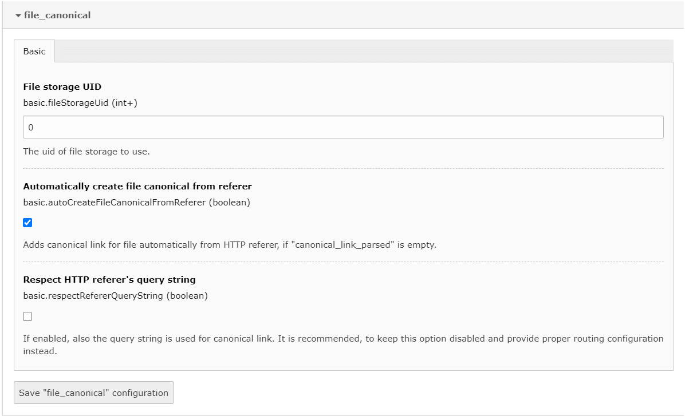

.. include:: ../Includes.txt

.. _settings:

Settings
========

File Canonical provides some extension settings, you can adjust:

Basic
-----

===================================== ============ ======================================
Property                               Type         Default
===================================== ============ ======================================
fileStorageUid_                        ``integer``  0
autoCreateFileCanonicalFromReferer_   ``boolean``  ``false``
respectRefererQueryString_            ``boolean``  ``false``
===================================== ============ ======================================

.. _fileStorageUid:

File storage UID
""""""""""""""""
.. container:: table-row

   Property
      fileStorageUid
   Data type
      integer
   Default
      0
   Description
      The UID of file storage to be used.

.. _autoCreateFileCanonicalFromReferer:

Automatically create file canonical from referer
""""""""""""""""""""""""""""""""""""""""""""""""
.. container:: table-row

   Property
      autoCreateFileCanonicalFromReferer
   Data type
      boolean
   Default
      false
   Description
      Adds canonical link for file automatically from HTTP referer, when enabled and
      when "canonical_link_parsed" field is empty.

.. _respectRefererQueryString:

Respect HTTP referer's query string
""""""""""""""""""""""""""""""""""""
.. container:: table-row

   Property
      respectRefererQueryString
   Data type
      boolean
   Default
      false
   Description
      If enabled, also the query string is used for canonical link. It is recommended, to keep this option disabled and provide proper routing configuration instead.
