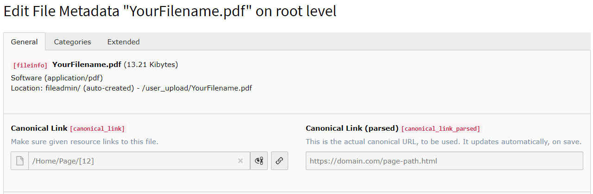
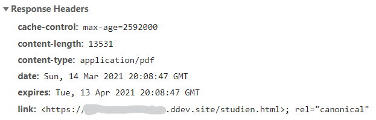
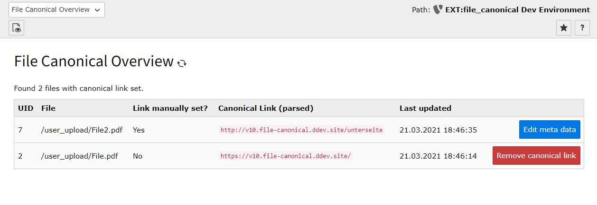

.. include:: ../Includes.txt

.. _welcome:

Welcome
=======

The File Canonical extension for TYPO3 provides canonical links (via HTTP headers) for files (e.g. in ``fileadmin/``).
This allows you to define a page, related to the requested file, which might be imported for SEO.

Features
--------

- Extending meta data of files in backend to allow editors to set canonical link for any file, manually
- Canonical link for files can get generated automatically by HTTP referer (configurable)
- Overview of files with canonical link set, as new info module
- Managing canonical link HTTP header when output file (.htaccess adjustments required)

Screenshots
-----------

Screenshot 1: Extended sys_file_metadata TCA
~~~~~~~~~~~~~~~~~~~~~~~~~~~~~~~~~~~~~~~~~~~~

Screenshot 2: Additional HTTP response header "link"
~~~~~~~~~~~~~~~~~~~~~~~~~~~~~~~~~~~~~~~~~~~~~~~~~~~~

Screenshot 3: Info module overview
~~~~~~~~~~~~~~~~~~~~~~~~~~~~~~~~~~

