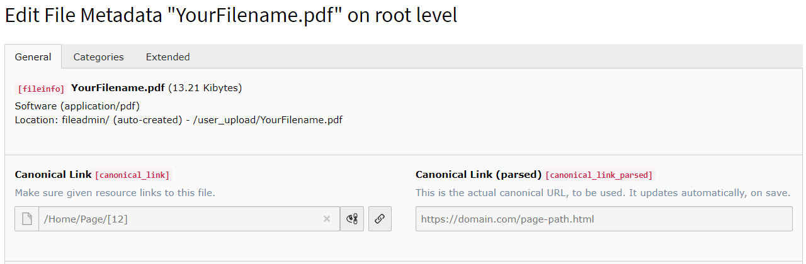
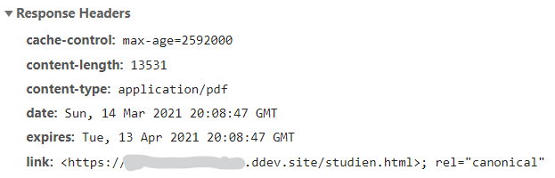
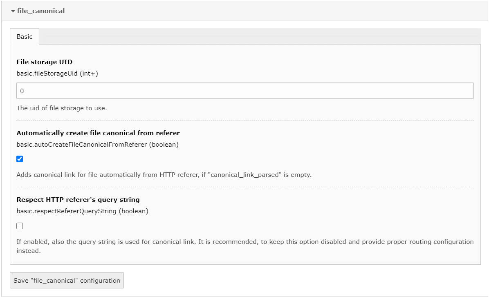

# EXT:file_canonical

This is an extension for TYPO3 CMS. It provides canonical links for files.

## Screenshots


Screenshot 1: *Extended sys_file_metadata TCA*



Screenshot 2: *Additional HTTP response header "link"*


## Installation

### Download

```
composer req t3/file-canonical
```

Or fetch from [TER](https://extensions.typo3.org/extension/file_canonical).


### Setup

After you've fetched and installed the file_canonical extension, like any other TYPO3 CMS extension,
you need to adjust the configuration of your webserver.

Usually TYPO3 does not process files which are actually existing.

For Apache, you need to add the following contents to **.htaccess** file, right after the ``TYPO3_CONTEXT``
has been set:

```apacheconf
# Rule for EXT:file_canonical
RewriteCond %{REQUEST_URI} ^/fileadmin
RewriteCond %{REQUEST_FILENAME} \.(pdf|docx|xlsx|pptx)$
RewriteRule ^.*$ %{ENV:CWD}index.php [QSA,L]
```

Now, all requests which point to ``/fileadmin`` and request a PDF or common office file, will be processed
by the ``FileCanonicalMiddleware`` provided by this extension.


### Extension settings




## Usage

To enable canonical link for a file:

1. Edit the file's metadata, in TYPO3 backend (see screenshot 1)
2. Set a page or record, on which this file is located at
3. After saving metadata, the canonical link get parsed and stored to database

Now, when requesting the file in Frontend, will add additional "Link" HTTP header (see screenshot 2).


### Auto Canonical Link

The extension creates the canonical link automatically from HTTP referer, if enabled. (see Extension settings)


## Roadmap

- Add Logging
- Add info module, which lists files with canonical link
  - There you should also be able, to remove the parsed canonical link
- Add translations for locallang
- Provide RST documentation
- Publish in TER and on Packagist
